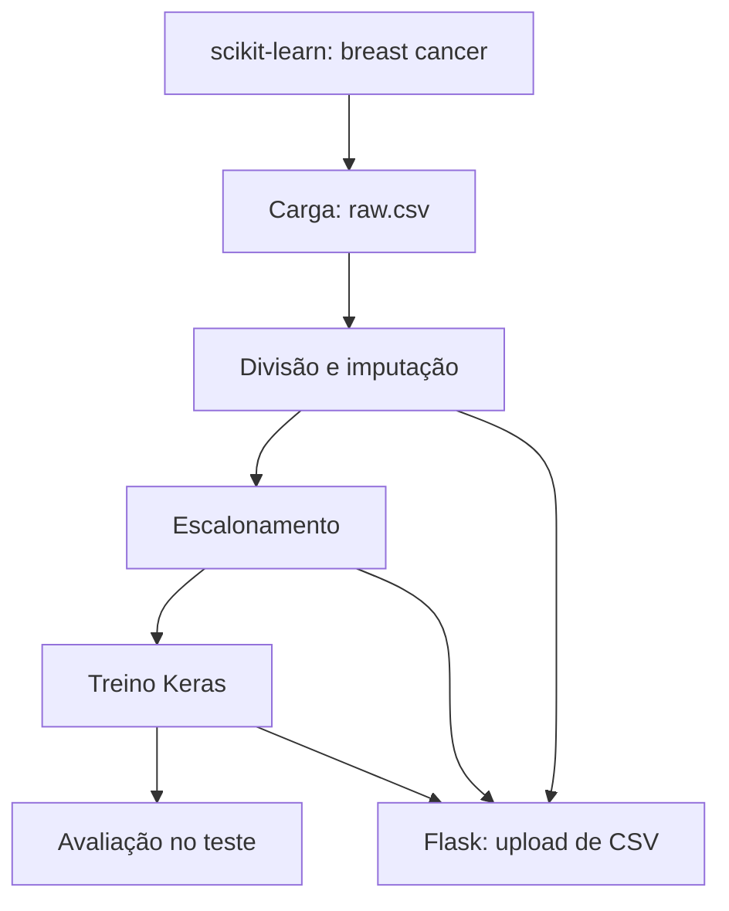

# Guia didático do `mlops_project`

**Repositório examinado:** https://github.com/chykynho/mlops_project/tree/main  
**Revisão:** 26/09/2026, branch `main`, commit visível `a25715c` (configuração inicial do DVC).  
**Público:** estudo e apresentação técnica. O classificador usa o dataset de câncer de mama do scikit-learn. **Não é uma ferramenta clínica, não foi validado para decisões médicas e não deve receber dados reais de pacientes.**

Este documento descreve o código publicado, distingue o que já funciona do que ainda falta e fornece comandos para executar no WSL. O `dvc.yaml` que acompanha este guia foi reconstruído a partir dos caminhos de leitura e gravação nos scripts publicados. Ele **não estava publicado no `main` no momento desta revisão** e ainda precisa ser executado no seu WSL.

## 1. Visão geral

O projeto transforma 30 atributos numéricos do dataset do scikit-learn em uma classificação com uma rede neural de duas camadas ocultas. O código separa o trabalho em cinco scripts e oferece uma interface Flask para enviar CSV. Os arquivos intermediários e o modelo são gravados no disco local.



**Distinção importante:** Git versiona scripts e configurações. DVC, quando o pipeline estiver publicado e executado, poderá registrar dependências, saídas e hashes no `dvc.lock`. O commit atual publica a inicialização `.dvc/`, mas não contém `dvc.yaml` ou `dvc.lock`. Não há remoto DVC configurado visível na árvore publicada; cache local não equivale a dados disponíveis a outra pessoa após `git clone`.

## 2. Mapa do código e contrato entre etapas

| Etapa | Script publicado | Entradas | Saídas gravadas pelo código |
|---|---|---|---|
| Carga | `src/data_loading/load_data.py` | `load_breast_cancer()` | `data/raw/raw.csv` |
| Pré-processamento | `src/data_preprocessing/preprocess_data.py` | `raw.csv`, `params.yaml` | `data/preprocessed/train_preprocessed.csv`, `test_preprocessed.csv`, `artifacts/[features]_mean_imputer.joblib` |
| Engenharia de atributos | `src/feature_engineering/engineer_features.py` | CSVs pré-processados | `data/processed/train_processed.csv`, `test_processed.csv`, `artifacts/[features]_scaler.joblib` |
| Treinamento | `src/model_training/train_model.py` | `train_processed.csv`, `params.yaml` | `models/model.keras`, `artifacts/[target]_one_hot_encoder.joblib`, `metrics/training.json` |
| Avaliação | `src/model_evaluation/evaluate_model.py` | `test_processed.csv`, modelo, encoder | `metrics/evaluation.json` |
| Inferência | `app/main.py` | CSV enviado a `/upload`, modelo, imputer, scaler, encoder | página HTML com previsões; não grava auditoria de inferências |

Os caracteres `[` e `]` fazem **parte literal** dos nomes dos três arquivos `.joblib`. Ao escrever comandos de shell com esses nomes, coloque o caminho entre aspas para evitar interpretação como padrão de glob.

### 2.1 Carga

`load_data.py` usa `sklearn.datasets.load_breast_cancer()`, coloca os atributos em um DataFrame, introduz ausências aleatórias em cerca de 5% de cada coluna de atributos com semente 42 e acrescenta a coluna `target`. A saída é `data/raw/raw.csv`. O diretório `data/raw` deve existir; o repositório mantém a estrutura com `.gitkeep`.

### 2.2 Pré-processamento

O script lê `preprocess_data.test_size` e `preprocess_data.random_seed` em `params.yaml` (atualmente 0,2 e 42), divide linhas em treino e teste e ajusta um `SimpleImputer(strategy="mean")` **somente nas features de treino**. O mesmo imputer transforma o teste. O target é reunido às features e o transformador é salvo via joblib. A imputação ajustada no treino evita vazar as estatísticas do conjunto de teste para o modelo.

### 2.3 Engenharia de atributos

`StandardScaler` é ajustado nas features do treino e aplicado também às features do teste. O target não é escalonado. As saídas desta etapa terminam em `*_processed.csv`, **não** `*_preprocessed.csv`.

### 2.4 Treino

O script lê a seção `train` de `params.yaml`: taxa de aprendizado 0,001; camadas de 64 e 32 neurônios; dropout 0,3; até 100 épocas; batch de 32; semente 42. Faz one-hot encoding do target, monta uma rede Keras com ReLU, dropout e softmax, usa `categorical_crossentropy`, separa 20% do conjunto de treino para validação e aplica `EarlyStopping` com paciência 10 e restauração dos melhores pesos. Grava o modelo, encoder e os **últimos** valores das métricas de histórico em `metrics/training.json`.

O docstring diz “logging ... with MLflow”, mas **não há chamada à API MLflow nesse script**. O JSON local não é um experimento MLflow.

### 2.5 Avaliação

O script carrega modelo, encoder e `test_processed.csv`, calcula classes por `argmax`, `classification_report` e matriz de confusão, e grava `metrics/evaluation.json`. O encoder é carregado e passado como argumento, porém **não participa do cálculo atual**; como as classes deste dataset são codificadas como 0 e 1, a avaliação tende a funcionar, mas a associação explícita de classes deveria ser verificada se o alvo mudar.

A acurácia de validação durante treino não substitui a avaliação do conjunto de teste. Observe especialmente recall e erros por classe; não anuncie uma métrica de produção a partir desse dataset didático.

### 2.6 Flask

`app/main.py` instancia `ModelService` **ao importar o módulo**. Portanto os quatro artefatos (modelo, imputer, scaler e encoder) precisam existir antes de iniciar Flask ou Gunicorn. A rota `/` serve `index.html`; `POST /upload` lê um CSV, exige os 30 nomes de colunas esperados, aplica imputer, scaler e modelo, e renderiza a previsão na página. Não é uma API JSON. Não há autenticação, limite de tamanho de upload, endpoint de health, métricas de latência ou monitoramento de drift implementados.

## 3. Preparação no WSL

Use o ambiente Conda `mlops` com Python 3.12. Execute cada comando em **uma linha**, dentro de `~/PythonProjects/mlops_project`:

```bash
conda activate mlops
```

```bash
python --version
```

```bash
python -m pip install -e .
```

```bash
python -m pip check
```

O `pyproject.toml` publicado fixa DVC 3.59.2 e `pathspec` 0.12.1, além de Flask, NumPy, pandas, PyYAML, scikit-learn, TensorFlow e Gunicorn. O Python 3.14 do ambiente `base` não atende à combinação fixa de dependências. Se abrir o projeto no VS Code conectado ao WSL, selecione `/home/francisco/miniconda3/envs/mlops/bin/python` em **Python: Select Interpreter**.

## 4. Executar sem DVC, passo a passo

Esta sequência ajuda a descobrir o estágio exato em que um erro ocorre. Rode cada linha separadamente e confira que o arquivo de saída apareceu antes de avançar:

```bash
python -m src.data_loading.load_data
```

```bash
python -m src.data_preprocessing.preprocess_data
```

```bash
python -m src.feature_engineering.engineer_features
```

```bash
python -m src.model_training.train_model
```

```bash
python -m src.model_evaluation.evaluate_model
```

Verifique as saídas de modo não destrutivo:

```bash
ls -lh data/raw data/preprocessed data/processed artifacts models metrics
```

```bash
python -m json.tool metrics/evaluation.json
```

A carga gera dados derivados do dataset do scikit-learn; o treino no TensorFlow pode usar CPU. A mensagem de bibliotecas CUDA ausentes é separada de erros Python fatais. Um `Traceback` posterior é que determina se a etapa falhou.

## 5. Executar com DVC

Copie o `dvc.yaml` fornecido junto a este guia para a raiz do projeto. Ele mantém exatamente os caminhos publicados pelos scripts e inclui `train.random_seed`, que o script usa. Antes de executar, confira as alterações locais e a interpretação das etapas:

```bash
git status --short
```

```bash
dvc stage list
```

```bash
dvc dag
```

```bash
dvc repro
```

```bash
dvc status
```

```bash
dvc metrics show
```

O primeiro `dvc repro` pode criar `dvc.lock` e cache local. Em execuções posteriores, DVC compara dependências, parâmetros e saídas para decidir o que refazer. Alterar `preprocess_data.test_size` deve afetar o pré-processamento e as etapas seguintes. Alterar apenas `train.epochs` deve afetar treino e avaliação. **Não use `dvc repro -f` sem necessidade**, pois ele força execução mesmo sem mudanças.

O arquivo `.gitignore` publicado contém regras duplicadas e uma linha colada, `artifacts/\[features\]_scaler.joblibbuild/`. A regra `build/` aparece novamente depois, mas convém limpar a duplicação quando revisar o projeto. Não remova as exclusões dos modelos ou dos dados antes de definir como serão versionados no DVC.

Antes de publicar os metadados do pipeline no Git, confira a lista exata. Os arquivos CSV, modelos e joblib ficam fora do Git; para compartilhá-los entre máquinas, será preciso configurar e usar um remoto DVC em etapa separada. Não crie um bucket ou remoto na nuvem apenas para seguir este guia.

```bash
git status --short
```

```bash
git add dvc.yaml dvc.lock
```

```bash
git diff --cached --name-only
```

Só faça commit depois de confirmar que a lista contém os metadados esperados e nenhum dado sensível.

## 6. Interface web e Docker

Após produzir os artefatos, inicie Flask localmente:

```bash
python app/main.py
```

Abra `http://localhost:5001`. A interface aceita CSV com os 30 nomes de atributos do dataset. Para estudar o contrato, gere um CSV fictício a partir de algumas linhas do dataset, sem usar dados de pacientes. A rota `/upload` retorna HTML.

O Dockerfile usa `python:3.12-slim`, instala `pip install ./mlops_project` e inicia Gunicorn em 5001. A imagem copia o projeto do **diretório local de build**; os modelos e artefatos são ignorados pelo Git e não existem em um clone limpo. Portanto, **treine primeiro e só então construa a imagem** se quiser usar a configuração atual:

```bash
docker build -t ml-classifier .
```

```bash
docker run --rm -p 5001:5001 ml-classifier
```

Este comportamento do Docker ainda não foi testado nesta revisão. Uma melhoria é separar o treino da imagem de inferência, publicar artefatos versionados e recuperá-los no deploy, em vez de depender de arquivos locais no contexto de build.

## 7. O que o projeto demonstra para uma vaga de MLOps

| Tema | Evidência no código publicado | Estado |
|---|---|---|
| Python e modularização | Cinco scripts em `src/` e Flask em `app/` | Implementado |
| Parametrização | `params.yaml` para split e hiperparâmetros | Implementado |
| Reprodutibilidade | Sementes no carregamento/split/treino; `pyproject.toml` com versões | Parcial: ainda requer execução e registro dos resultados |
| Versionamento de dados | `.dvc/` inicializado | Pipeline `dvc.yaml` ainda não publicado no `main` nesta revisão; remoto DVC não verificado |
| Experimentos MLflow | Apenas docstring menciona MLflow | Não implementado |
| API de inferência | Flask `POST /upload` | Implementado como resposta HTML, sem contrato JSON |
| Docker | Dockerfile com Gunicorn | Definido; depende de artefatos locais antes do build |
| CI/CD | Não há workflow `.github/workflows` na árvore publicada | Não implementado |
| Monitoramento e drift | Avaliação offline e arquivos JSON | Monitoramento em produção não implementado |
| AWS/IaC | Nenhum manifesto Terraform/CloudFormation ou integração AWS visível | Não implementado |

### Melhorias em ordem prática

1. Publicar e executar `dvc.yaml`; registrar `dvc.lock`, verificar `dvc metrics show` e documentar execução real.
2. Criar testes para contrato de features, ausência de dados, artefatos e rota `/upload`.
3. Separar empacotamento de modelo e deploy; garantir que a imagem de inferência inicie a partir de artefatos versionados.
4. Adicionar CI para testes, lint e build; estabelecer um gate de métricas antes de promover modelos.
5. Integrar MLflow de verdade com parâmetros, métricas, artefatos e identificação de versão do modelo.
6. Instrumentar latência, falhas, distribuição de entradas e drift, com atenção ao tratamento de dados de saúde.
7. Planejar implantação AWS/IaC, IAM mínimo, rollback e observabilidade somente após validar o fluxo local.

## 8. Diagnóstico rápido

| Sintoma | Interpretação | Primeiro comando |
|---|---|---|
| `tensorflow==2.19.0` não encontrado com Python 3.14 | Versão de Python incompatível | `python --version` |
| DVC não encontra `_DIR_MARK` | DVC 3.59.2 com `pathspec` 1.x | `python -m pip show dvc pathspec` |
| `dvc.yaml` tem chave `cmd` duplicada | Estrutura/indentação YAML inválida | `dvc stage list` |
| `No such file ... train_processed.csv` | Etapa anterior não gerou a saída esperada | `ls -lh data/processed` |
| Flask/Gunicorn falha ao importar `app.main` | Modelo ou joblib ausente | `ls -lh models artifacts` |
| Docker funciona localmente, falha após clone | Artefatos não estão no Git e não há remoto DVC | `git status --short` |

## 9. Glossário para apresentação

- **Feature:** variável de entrada do modelo; aqui, uma das 30 medições numéricas.
- **Target:** classe conhecida usada como resposta no treino e teste.
- **Imputação:** preenchimento de valores ausentes com estatística aprendida no treino.
- **Escalonamento:** transformação numérica ajustada no treino e reaplicada às novas entradas.
- **Data leakage:** uso indevido de informação de teste ou futuro ao ajustar o modelo.
- **Artefato:** modelo ou transformador persistido; precisa de versão e rastreabilidade.
- **DVC stage:** comando com dependências, parâmetros e saídas declaradas em `dvc.yaml`.
- **DVC lock:** registro das versões/hashes utilizados na execução do pipeline.
- **Métrica offline:** medida calculada em um conjunto de teste; não substitui monitoramento real.
- **Drift:** alteração da distribuição de entradas ou da relação entre entradas e resultado ao longo do tempo.

## 10. Fontes do projeto revisadas

- Repositório e README: https://github.com/chykynho/mlops_project/tree/main
- Carga: https://github.com/chykynho/mlops_project/blob/main/src/data_loading/load_data.py
- Pré-processamento: https://github.com/chykynho/mlops_project/blob/main/src/data_preprocessing/preprocess_data.py
- Atributos: https://github.com/chykynho/mlops_project/blob/main/src/feature_engineering/engineer_features.py
- Treino: https://github.com/chykynho/mlops_project/blob/main/src/model_training/train_model.py
- Avaliação: https://github.com/chykynho/mlops_project/blob/main/src/model_evaluation/evaluate_model.py
- Flask: https://github.com/chykynho/mlops_project/blob/main/app/main.py
- Parâmetros: https://github.com/chykynho/mlops_project/blob/main/params.yaml
- Dependências: https://github.com/chykynho/mlops_project/blob/main/pyproject.toml
- Dockerfile: https://github.com/chykynho/mlops_project/blob/main/Dockerfile
